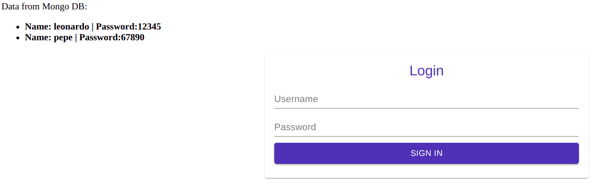

# REACT - NODE - MONGO - NGINX :fire:

## Descripción

-   Es una app que nace con el fin de practicar la dockerizacion y la orquestacion
-   La app esta compuesta de ReactJs - Node - Mongo - Nginx - Docker - K8S
-   Se puede correr la app con `docker-compose` y/o `minikube`
-   Al correrla con `docker-compose` cuenta con un contenedor Nginx con el objectivo de hacer `reverse-proxy` hacia los contenedores ReactJs o NodeJs; de esta manera se asegura la convivencia de los distintos request, bien sea con `docker-compose` y/o `minikube`
-   La base de dato Mongo, importa automatico bien sea en el `docker-compose` y/o `minikube`, datos de prueba.

## Instalación - Docker-Compose

1. Instalarse [ Docker Engine ](https://docs.docker.com/engine/install/) :fire:
2. Ir a la raiz del proyecto y ejecutar => `docker-compose build`
3. Ir a la raiz del proyecto y ejecutar => `docker-compose up -d`
4. Ir a la app [ App ](http://127.0.0.1:8081/)
5. Empezar a leer código, interpretar funcionalidades y programar :smile:

## Instalación - K8S

1. Instalarse [ Docker Engine ](https://docs.docker.com/engine/install/) :fire:
2. Instalarse [ Minikube ](https://minikube.sigs.k8s.io/docs/start/) :fire:
3. Ir a la raiz del proyecto y ejecutar => `minikube start`
4. Ir a la raiz del proyecto y ejecutar => `minikube addons enable ingress` (Habilita el usar ingress para redirigir el trafico a los distintos servicios)
5. Ejecutar `minikube ip`, retorna la ip del cluster de K8S (Ej: 192.168.49.2). Copiarla e ir al archivo `hosts` y anadir el DNS para poder probar la app, ya que el servicio ingress no funciona por IP sino por DNS. `cd /etc/` luego `sudo nano hosts`. Agregarla `<IP COPIADA> rnmn.dev`
6. Ir a la raiz del proyecto y ejecutar en el siguiente orden:

-   `kubectl apply -f env-configmap.yaml`
-   `kubectl apply -f mongo-db-deployment.yaml`
-   `kubectl apply -f node-app-deployment.yaml`
-   `kubectl apply -f react-app-deployment.yaml`
-   `kubectl apply -f ingress-srv.yaml`

7. Ejecutar `kubectl get all`, se veran todos los deployments, pods, services y replicas.
   
8. Ir a la app [ App ](http://rnmn.dev/)
9. Empezar a leer código, interpretar funcionalidades y programar :smile:

## Screenshots

Login.

