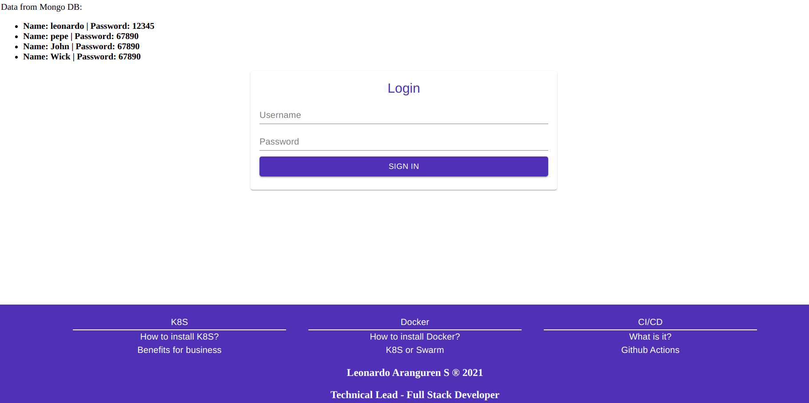
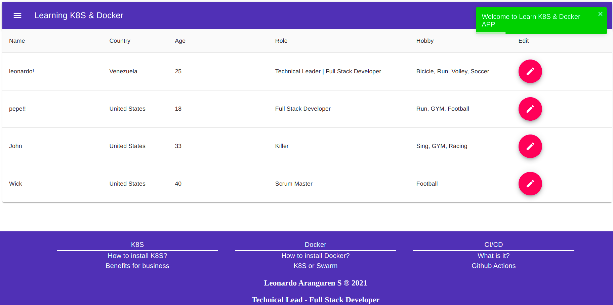

# REACT - NODE - MONGO - NGINX :fire: | Español

## Descripción

-   Es una app que nace con el fin de practicar la dockerizacion, la orquestacion y el CI/CD.
-   La app esta compuesta de ReactJs - NodeJS - Mongo - Nginx - Docker - K8S - CI/CD
-   Se puede correr la app con `docker-compose` y/o `minikube`
-   Al correrla con `docker-compose` cuenta con un contenedor Nginx con el objectivo de hacer `reverse-proxy` hacia los contenedores ReactJs o NodeJs; de esta manera se asegura la convivencia de los distintos request, bien sea con `docker-compose` y/o `minikube`
-   La base de dato Mongo, importa automatico bien sea en el `docker-compose` y/o `minikube`, datos de prueba.
-   Al usar minikube, se puede tener acceso al [ Kubernetes Dashboard ](https://kubernetes.io/docs/tasks/access-application-cluster/web-ui-dashboard/), en el se puede visualizar todos los services, pods, namespaces, configmap, dinamicas, etc... se puede utilizar el boton 'skip' para saltarse el token del login.
-   El CI/CD se utiliza con github actions, el cual cumple la funcion de hacer login en dockerhub y actualizar las imagenes, siempre y cuando exista cambio en la carpeta respectiva.

## Instalación - Docker-Compose

1. Instalarse [ Docker Engine ](https://docs.docker.com/engine/install/) :fire:
2. Ir a la raiz del proyecto y ejecutar => `docker-compose build`
3. Ir a la raiz del proyecto y ejecutar => `docker-compose up -d`
4. Ir a la app [ App ](http://127.0.0.1:55/)
5. Empezar a leer código, interpretar funcionalidades y programar :smile:

## Instalación - K8S

1. Instalarse [ Docker Engine ](https://docs.docker.com/engine/install/) :fire:
2. Instalarse [ Minikube ](https://minikube.sigs.k8s.io/docs/start/) :fire:
3. Ir a la raiz del proyecto y ejecutar => `minikube start`
4. Ir a la raiz del proyecto y ejecutar => `minikube addons enable ingress` (Habilita el usar ingress para redirigir el trafico a los distintos servicios)
5. Ejecutar `minikube ip`, retorna la ip del cluster de K8S (Ej: 192.168.49.2). Copiarla e ir al archivo `hosts` y anadir el DNS para poder probar la app y el DNS para el dashboard, ya que el servicio ingress no funciona por IP sino por DNS. `cd /etc/` luego `sudo nano hosts`. Agregar `<IP COPIADA> rnmn.dev` y `<IP COPIADA> kb.dev`
6. Ir a la raiz del proyecto y ejecutar en el siguiente orden:

-   `kubectl apply -f configmap.yaml`
-   `kubectl apply -f mongo-depl.yaml`
-   `kubectl apply -f node-depl.yaml`
-   `kubectl apply -f react-depl.yaml`
-   `kubectl apply -f dashboard-depl.yaml`
-   `kubectl apply -f ingress-srv.yaml`
-   `kubectl apply -f dashboard-ingress-srv.yaml`

7. Ejecutar `kubectl get all`, se veran todos los deployments, pods, services y replicas.
   
8. Ir a la app [ App ](http://rnmn.dev/)
9. Empezar a leer código, interpretar funcionalidades y programar :smile:

---

# REACT - NODE - MONGO - NGINX :fire: | English

## Description

-   It is an app that was created in order to practice dockerization and orchestration CI/CD.
-   The app is made up of ReactJs - NodeJS - Mongo - Nginx - Docker - K8S - CI/CD
-   You can run the application with `docker-compose` and / or` minikube`
-   When running with `docker-compose` it has an Nginx container with the objective of doing` reverse-proxy` towards the ReactJs or NodeJs containers; in this way the coexistence of the different requests is ensured, either with `docker-compose` and / or` minikube`
-   The Mongo database, imports automatically either in the `docker-compose` and / or` minikube`, test data.
-   By using minikube, you can access the [Kubernetes Dashboard](https://kubernetes.io/docs/tasks/access-application-cluster/web-ui-dashboard/), where you can view all the services, pods, namespaces, configmap, dynamics, etc ... you can use the 'skip' button to skip the login token.
-   The CI / CD is used with github actions, which fulfills the function of logging into dockerhub and updating the images, as long as there is a change in the respective folder.

## Instalation - Docker-Compose

1. Install [ Docker Engine ](https://docs.docker.com/engine/install/) :fire:
2. Go to the root of the project and run => `docker-compose build`
3. Go to the root of the project and run => `docker-compose up -d`
4. Go to the app [ App ](http://127.0.0.1:55/)
5. Start reading code, interpreting functionalities and programming: smile:

## Instalation - K8S

1. Install [Docker Engine](https://docs.docker.com/engine/install/): fire:
2. Install [Minikube](https://minikube.sigs.k8s.io/docs/start/): fire:
3. Go to the root of the project and execute => `minikube start`
4. Go to the root of the project and execute => `minikube addons enable ingress` (Enables using ingress to redirect traffic to the different services)
5. Execute `minikube ip`, it returns the IP of the K8S cluster (Ex: 192.168.49.2). Copy it and go to the `hosts` file and add the DNS to be able to test the app and the DNS for the dashboard, since the ingress service does not work by IP but by DNS. `cd / etc /` then `sudo nano hosts`. Add `<COPIED IP> rnmn.dev` and` <COPIED IP> kb.dev`
6. Go to the root of the project and execute in the following order:

-   `kubectl apply -f configmap.yaml`
-   `kubectl apply -f mongo-depl.yaml`
-   `kubectl apply -f node-depl.yaml`
-   `kubectl apply -f react-depl.yaml`
-   `kubectl apply -f dashboard-depl.yaml`
-   `kubectl apply -f ingress-srv.yaml`
-   `kubectl apply -f dashboard-ingress-srv.yaml`

7. Run `kubectl get all`, you will see all the deployments, pods, services and replicas.
   
8. Go to the app [App](http://rnmn.dev/)
9. Start reading code, interpreting functionalities and programming: smile:

## Screenshots

Login.

Dashboard.

Modal Edit User.

Kubernetes Dashboard - Link.

Kubernetes Dashboard - Login.

Kubernetes Dashboard - Pods.

Kubernetes Dashboard - Describe a Pod.

CI/CD - Github Action

